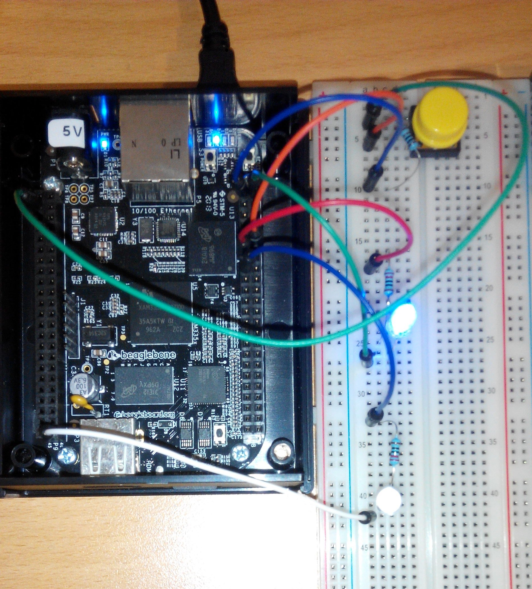

# NeCTAR Button on Beaglebone Black(BBB)

## Overview

This project is to make a button that can start and monitor instances on NeCTAR research cloud (Openstack Cloud). 

## Components
* BeagleBone Black (With Ubuntu 13.04)
* Breadboard
* 1*blue LED
* 1*red LED
* 2*220Ω resistor (for LED)
* 1*button
* 1*1KΩ resistor (for button)
* 7*Male to Male jumper wires

## Operating System and Software
* [Install Ubuntu 13.04 on BBB](http://elinux.org/BeagleBoardUbuntu#Raring_13.04)
* [Install the Adafruit-BeagleBone-IO-Python on BBB](http://learn.adafruit.com/setting-up-io-python-library-on-beaglebone-black/installation-on-ubuntu)
* Install nova client : ```apt-get install python-novaclient```

## Wiring


## Coding
* See *.sh and *.py

## Runing
* Prepare novarc(replace 'blah' with your own credentials)

``` bash
cd BBB-nectar-button
cat novarc
#!/bin/bash
export OS_AUTH_URL=blah
export OS_TENANT_ID=blah
export OS_TENANT_NAME=blah
export OS_USERNAME=blah
export OS_PASSWORD=blah
```
* Configure testrc(Change the values to suit your environment)

```bash
#!/bin/bash
export TEST_IMAGE_ID=034f7d4d-4ec2-424d-bbff-a4b8809dc01d
export TEST_FLAVOR=m1.small
export TEST_SEC_GROUP=sa-test
export TEST_KEY_NAME=ray_nectar
export TEST_KEY_FILE=ray_nectar.pem
export TEST_AVA_ZONE=sa
export TEST_INSTANCE_NAME_BASE=lei-test-BBB
export TEST_INSTANCE_USER=ubuntu
export retry_max=10
export retry_interval=3
```
* Place your key file under BBB-nectar-button/
 - The key file name must be the same as ${TEST_KEY_FILE} defined in testrc file
* Start nectar_button.py

```bash
cd BBB-nectar-button
./nectar_button.py
Press (and hold) the button to launch instance(s) ... 
```
* Then press the button(the longer the button is held the more instances launched)
* LED Status
 - Blue LED flashing -- In progress(launching and monitoring instances)
 - Blue LED solid lit -- Success(instances are all active and ssh-able)
 - Red LED -- Fail(Not all the instances become active and ssh-able in the given time)
